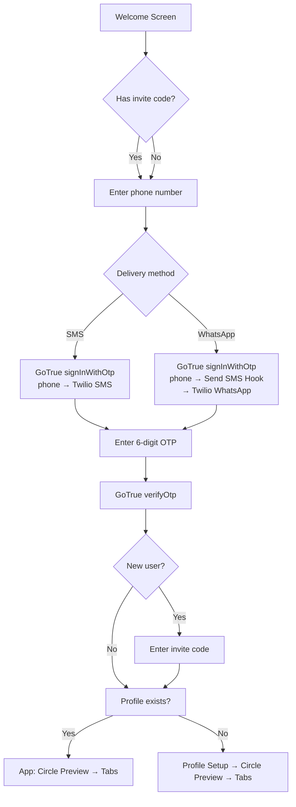

# Trésor — User Management & Onboarding Architecture
### Phone-First Auth (SMS OTP primary, WhatsApp OTP secondary, Email/password fallback)

**Author:** Nigel (System Architect)
**Status:** DRAFT — for Nasser's approval before implementation
**Date:** 2026-08-07

---

## Table of Contents

1. [Executive Summary](#1-executive-summary)
2. [Current State Analysis](#2-current-state-analysis)
3. [Architecture Overview](#3-architecture-overview)
4. [Primary Auth: UAE Mobile SMS OTP](#4-primary-auth-uae-mobile-sms-otp)
5. [Secondary Auth: WhatsApp OTP](#5-secondary-auth-whatsapp-otp)
6. [Tertiary Auth: Email/Password Fallback](#6-tertiary-auth-emailpassword-fallback)
7. [Onboarding Flow Redesign](#7-onboarding-flow-redesign)
8. [Database Schema Changes](#8-database-schema-changes)
9. [SMS & WhatsApp Provider Research for UAE](#9-sms--whatsapp-provider-research-for-uae)
10. [Security](#10-security)
11. [Migration Plan](#11-migration-plan)
12. [Sources](#12-sources)

---

## 1. Executive Summary

Trésor currently uses email/password authentication (a pivot from the original phone-OTP design). This document specifies a **phone-first auth architecture** with three tiers:

| Tier | Method | Use Case | Status |
|------|--------|----------|--------|
| **PRIMARY** | UAE mobile (+971) SMS OTP | Default path, 90%+ of users | New — needs implementation |
| **SECONDARY** | WhatsApp OTP (same phone number) | WhatsApp-dominant UAE market | New — needs implementation |
| **TERTIARY** | Email/password | Edge cases, dev fallback | Existing — keep as fallback |

**Key decisions:**

- **SMS OTP** uses Supabase GoTrue's native phone auth. For local dev, Supabase's built-in `test_otp` map provides fixed OTPs — no real SMS needed. The Twilio config already exists in `config.toml` but is inactive (empty env vars).
- **WhatsApp OTP** uses Supabase's **Send SMS Hook** — a server-side edge function that intercepts GoTrue's OTP and delivers it via Twilio's WhatsApp API instead of SMS. Supabase generates and verifies the OTP; only delivery is custom. This avoids building a parallel custom auth system.
- **Email/password** stays as-is. Account linking is done via `supabase.auth.updateUser()` — a phone-first user can add an email later (and vice versa).
- **Invite code** moves to **after** phone verification, not before. This prevents invite-code harvesting and ensures the user is authenticated before joining a circle.

**Cost estimate (5–15 users):** ~$1–5/month for SMS, ~$0.50–3/month for WhatsApp. Well within the $20–50/mo budget. See [§9](#9-sms--whatsapp-provider-research-for-uae).

---

## 2. Current State Analysis

### 2.1 What exists today

**Auth screens** (`app/app/(auth)/`):

| Screen | File | Current behavior |
|--------|------|-----------------|
| Welcome | `welcome.tsx` | Logo + "Get Started" → invite-code |
| Invite Code | `invite-code.tsx` | Validates code, previews circle, → phone-otp |
| Phone OTP | `phone-otp.tsx` | **Repurposed as email/password login** (sign-in/sign-up modes). Named "phone-otp" but does email auth. |
| Profile Setup | `profile-setup.tsx` | Name + avatar, calls `createProfile`, `joinCircle` |
| Circle Preview | `circle-preview.tsx` | Shows circle members, "Start Adding Items" → tabs |

**Current flow:**
```
Welcome → Invite Code → Email/Password → Profile Setup → Circle Preview → App
```

**Auth context** (`src/context/AuthContext.tsx`):

- Email/password via `supabase.auth.signInWithPassword()` and `supabase.auth.signUp()`
- Phone OTP functions exist (`signInWithPhone`, `verifyOtp`) and call `supabase.auth.signInWithOtp({ phone })` and `supabase.auth.verifyOtp({ phone, token, type: 'sms' })` — but the UI doesn't use them
- Comment says: "Phone OTP requires Twilio, skipped for local dev"

**Supabase config** (`supabase/config.toml`):

```toml
[auth.sms]
enable_signup = true
enable_confirmations = true
template = "Your code is {{ .Code }}"
max_frequency = "5s"

# Test OTP — commented out (inactive)
# [auth.sms.test_otp]
# 4152127777 = "123456"

[auth.sms.twilio]
enabled = true
account_sid = "env(SUPABASE_AUTH_SMS_TWILIO_ACCOUNT_SID)"
message_service_sid = "env(SUPABASE_AUTH_SMS_TWILIO_MESSAGE_SERVICE_SID)"
auth_token = "env(SUPABASE_AUTH_SMS_TWILIO_AUTH_TOKEN)"
```

Twilio is configured but env vars are empty in `.env.local` — so phone OTP is effectively disabled.

**Env vars** (`app/.env.example`):
```
SUPABASE_AUTH_SMS_TWILIO_ACCOUNT_SID=
SUPABASE_AUTH_SMS_TWILIO_AUTH_TOKEN=
SUPABASE_AUTH_SMS_TWILIO_MESSAGE_SERVICE_SID=
```

### 2.2 Database schema (current)

**`profiles` table** (migration 0001 → 0006):

```sql
create table public.profiles (
  id           uuid primary key references auth.users(id) on delete cascade,
  phone        text,                    -- 0001: NOT NULL UNIQUE
                                         -- 0006: nullable, partial unique index
  display_name text,
  avatar_url   text,
  push_token   text,
  bio          text,
  created_at   timestamptz not null default now(),
  updated_at   timestamptz not null default now()
);

-- After migration 0006:
ALTER TABLE public.profiles ALTER COLUMN phone DROP NOT NULL;
CREATE UNIQUE INDEX profiles_phone_unique_not_null
  ON public.profiles (phone) WHERE phone IS NOT NULL;
```

Migration 0006 made phone nullable to support email-only users. We'll reverse this for the phone-first architecture (see [§8](#8-database-schema-changes)).

**Seed data** (`supabase/seed.sql`): Three test users (Sarah, Layla, Maya) with email/password auth and masked phone numbers (`+971****1111`, etc.). These are placeholder phone values — not E.164 format.

### 2.3 Problems with current state

1. **Phone OTP is stubbed but not wired up.** The AuthContext has the functions, but the UI uses email/password. The file is named `phone-otp.tsx` but does email auth.
2. **Test OTP not configured.** The `[auth.sms.test_otp]` block is commented out, so even if Twilio env vars are empty, there's no fallback for local dev.
3. **No phone normalization.** No UAE-specific phone formatting logic exists.
4. **No WhatsApp path.** Not implemented, not designed.
5. **Invite code before auth.** The invite code is validated before the user is authenticated. `validateInviteCode()` is a public query (no RLS gate on the `circles` table SELECT for anon users — the `circles_select_members` policy only works for authenticated users, but the invite validation query runs against `circles` which has `circles_insert_any` with `with check (true)` for INSERT; for SELECT it requires `is_circle_member(id)` which requires `auth.uid()` — so anon users can't actually validate invite codes). **This is a latent bug**: invite code validation silently fails for unauthenticated users.

---

## 3. Architecture Overview

### 3.1 Auth tier diagram

```
┌─────────────────────────────────────────────────────────────┐
│                    Trésor Auth Architecture                   │
├─────────────────────────────────────────────────────────────┤
│                                                              │
│  ┌──────────────────┐  ┌──────────────────┐  ┌────────────┐│
│  │  PRIMARY (90%+)  │  │  SECONDARY       │  │ TERTIARY   ││
│  │  UAE Mobile SMS  │  │  WhatsApp OTP    │  │ Email/Pass ││
│  │  OTP             │  │  (same number)   │  │ (fallback) ││
│  └────────┬─────────┘  └────────┬─────────┘  └─────┬──────┘│
│           │                      │                  │       │
│           ▼                      ▼                  ▼       │
│  ┌────────────────────────────────────────────────────────┐ │
│  │           Supabase GoTrue (auth.users)                 │ │
│  │  ┌─────────────┐  ┌──────────────┐  ┌───────────────┐ │ │
│  │  │ Phone OTP   │  │ Send SMS Hook│  │ Email/Pass    │ │ │
│  │  │ (native)    │  │ (edge fn)    │  │ (native)      │ │ │
│  │  └──────┬──────┘  └──────┬───────┘  └───────────────┘ │ │
│  └─────────┼────────────────┼──────────────────────────────┘│
│            │                │                                │
│            ▼                ▼                                │
│  ┌──────────────┐  ┌──────────────────┐                     │
│  │ Twilio SMS   │  │ Twilio WhatsApp  │                     │
│  │ API          │  │ Business API     │                     │
│  │ (or test_otp │  │ (via edge fn)    │                     │
│  │  for dev)    │  │                  │                     │
│  └──────────────┘  └──────────────────┘                     │
│                                                              │
└─────────────────────────────────────────────────────────────┘
```

### 3.2 Auth flow (high-level)



### 3.3 Key architectural decision: Send SMS Hook for WhatsApp

**The critical insight:** Supabase's [Send SMS Hook](https://supabase.com/docs/guides/auth/auth-hooks/send-sms-hook) lets us intercept the OTP delivery and route it through **any channel** — including WhatsApp. The hook receives the generated OTP and phone number; we send it via Twilio's WhatsApp API instead of SMS. Supabase still handles OTP generation, verification, and session management.

This means:
- **No custom auth endpoint needed.** GoTrue generates the OTP, our edge function delivers it via WhatsApp, GoTrue verifies it.
- **No parallel OTP table.** The OTP lives in GoTrue's internal state.
- **The same `verifyOtp()` call works** for both SMS and WhatsApp — the verification path is identical.
- **The user's `phone` field in `auth.users`** is set identically regardless of delivery channel.

The delivery channel (SMS vs WhatsApp) is a **client-side choice** that determines which hook path fires. We achieve this by using a different "phone" format or a metadata flag that the edge function reads to decide the channel. (See [§5.4](#54-channel-selection-mechanism) for implementation detail.)

---

## 4. Primary Auth: UAE Mobile SMS OTP

### 4.1 How Supabase GoTrue Phone OTP works

Supabase's GoTrue auth server has native phone OTP support. The flow:

1. **Client calls** `supabase.auth.signInWithOtp({ phone: '+9715XXXXXXXX' })`
2. **GoTrue generates** a 6-digit OTP, stores it hashed in `auth.users` (with expiration)
3. **GoTrue triggers SMS delivery:**
   - If `test_otp` is configured and the phone matches → skip delivery, accept only the mapped code
   - If Twilio is configured → send via Twilio SMS API
   - If Send SMS Hook is configured → call the hook (edge function) with the OTP and phone
4. **User enters** the 6-digit code
5. **Client calls** `supabase.auth.verifyOtp({ phone, token, type: 'sms' })`
6. **GoTrue verifies** the code, creates a session, returns access + refresh tokens
7. **`onAuthStateChange`** fires → AuthContext updates → app navigates

**OTP settings** (from `config.toml`):
- Length: 6 digits (default)
- Expiration: 60 seconds default (GoTrue), configurable via `SMS_OTP_EXP` — **recommend increasing to 300s (5 min)** for UX
- Rate limit: `max_frequency = "5s"` (minimum 5s between sends to same number)
- Global rate limit: `sms_sent = 30` per hour

### 4.2 UAE Phone Normalization

UAE mobile numbers follow the format `+971 5X XXX XXXX` (9 digits after country code, starting with 5).

**Normalization rules:**

| Input format | Normalized (E.164) |
|-------------|-------------------|
| `+971 50 123 4567` | `+971501234567` |
| `971501234567` | `+971501234567` |
| `0501234567` | `+971501234567` |
| `501234567` | `+971501234567` |
| `+971 56 123 4567` | `+971561234567` |

**Validation regex:** `^(\+971|0)?(5[0-9])\d{7}$`

**Implementation** (TypeScript utility — new file `src/lib/phone.ts`):

```typescript
/**
 * Normalize a UAE phone number to E.164 format.
 * Accepts: +9715XXXXXXXX, 9715XXXXXXXX, 05XXXXXXXX, 5XXXXXXXX
 * Returns: +9715XXXXXXXX
 * Throws: Error if not a valid UAE mobile number.
 */
export function normalizeUaePhone(input: string): string {
  // Remove all whitespace, dashes, parentheses
  const cleaned = input.replace(/[\s\-()]/g, '');

  // Strip leading + or 00
  let digits = cleaned.replace(/^\+/, '').replace(/^00/, '');

  // Remove leading country code or trunk prefix
  if (digits.startsWith('971')) {
    digits = digits.slice(3);
  } else if (digits.startsWith('0')) {
    digits = digits.slice(1);
  }

  // Validate: must be 9 digits starting with 5
  if (!/^5\d{8}$/.test(digits)) {
    throw new Error(
      'Invalid UAE mobile number. Expected format: 05X XXX XXXX or +971 5X XXX XXXX'
    );
  }

  return `+971${digits}`;
}

/** Check if a phone number is a valid UAE mobile number. */
export function isValidUaePhone(input: string): boolean {
  try {
    normalizeUaePhone(input);
    return true;
  } catch {
    return false;
  }
}
```

### 4.3 OTP Request → Verify → Session Flow

```
┌─────────┐                    ┌──────────┐              ┌─────────┐
│  App    │                    │ GoTrue   │              │ Twilio  │
│ (RN)    │                    │ (Supabase)│              │ (SMS)   │
└────┬────┘                    └────┬─────┘              └────┬────┘
     │                              │                         │
     │ 1. signInWithOtp({phone})    │                         │
     │─────────────────────────────►│                         │
     │                              │ 2. Generate 6-digit OTP │
     │                              │    Store hash + expiry  │
     │                              │                         │
     │  200 OK (no OTP in response) │                         │
     │◄─────────────────────────────│                         │
     │                              │ 3. Send SMS via Twilio  │
     │                              │────────────────────────►│
     │                              │                         │ 4. SMS to user
     │                              │                         │──────►📱
     │                              │                         │
     │ 5. User enters OTP in app    │                         │
     │                              │                         │
     │ 6. verifyOtp({phone, token,  │                         │
     │    type:'sms'})              │                         │
     │─────────────────────────────►│                         │
     │                              │ 7. Verify hash + expiry │
     │                              │    Create session       │
     │                              │    Set phone_confirmed  │
     │                              │                         │
     │ 8. { session, user }         │                         │
     │◄─────────────────────────────│                         │
     │                              │                         │
     │ 9. onAuthStateChange fires  │                         │
     │    AuthContext updates       │                         │
     │    Navigate to next screen   │                         │
     │                              │                         │
```

### 4.4 Local Dev: Supabase Test Phone Provider

Supabase provides a built-in test OTP mechanism for local development. When a phone number matches the `test_otp` map, GoTrue **skips SMS delivery entirely** and accepts only the mapped code.

**Configuration** (in `supabase/config.toml`):

```toml
[auth.sms]
enable_signup = true
enable_confirmations = true
template = "Your Trésor code is {{ .Code }}"
max_frequency = "5s"

# ── Local dev: fixed OTPs for test numbers ──
# No SMS is sent for these numbers. GoTrue accepts only the mapped code.
# Use UAE-format numbers for realistic testing.
[auth.sms.test_otp]
"+971501234567" = "123456"
"+971502345678" = "234567"
"+971503456789" = "345678"
"+971511111111" = "111111"   # Sarah (dev)
"+971522222222" = "222222"   # Layla (dev)
"+971533333333" = "333333"   # Maya  (dev)
```

**How it works:**
1. App calls `signInWithOtp({ phone: '+971501234567' })`
2. GoTrue sees the number in `test_otp` → does NOT call Twilio → returns 200
3. App calls `verifyOtp({ phone: '+971501234567', token: '123456', type: 'sms' })`
4. GoTrue verifies against the test map → creates session

**Important:** Test OTPs only work in local dev (self-hosted Supabase). In production (Supabase Cloud), the `test_otp` config is ignored — real SMS is always sent via the configured provider.

**Seed data update:** The current seed.sql uses masked phone numbers (`+971****1111`). For phone OTP testing, these should be replaced with real test numbers from the `test_otp` map above.

### 4.5 Production: SMS Provider Selection

See [§9](#9-sms--whatsapp-provider-research-for-uae) for the full comparison. **Summary:**

| Provider | UAE SMS cost/msg | Supabase native? | Recommendation |
|----------|-----------------|-------------------|----------------|
| **Twilio** | ~$0.015/msg | ✅ Native (`[auth.sms.twilio]`) | **Recommended** — already configured, lowest friction |
| MessageBird | ~$0.0033/msg (US rate; UAE may differ) | ✅ Native (`[auth.sms.messagebird]`) | Cheaper but UAE rate unclear; no UAE Sender ID registration support |
| Unifonic | UAE-local, AED pricing | ❌ Not native (needs Send SMS Hook) | Best UAE delivery + Sender ID registration, but requires custom hook |

**Recommendation:** Start with **Twilio** (already in config, native GoTrue support). If UAE delivery issues arise, switch to Unifonic via the Send SMS Hook. The hook architecture means switching providers is a config change, not a code change.

---

## 5. Secondary Auth: WhatsApp OTP

### 5.1 Research Summary

WhatsApp is the dominant messaging platform in the UAE — most users check WhatsApp more frequently than SMS. Offering WhatsApp OTP delivery improves UX and provides a fallback when SMS delivery is unreliable (UAE carrier filtering can block unregistered Sender IDs).

**Key findings:**

1. **Supabase does NOT natively support WhatsApp OTP.** GoTrue's phone auth only supports SMS delivery via Twilio, MessageBird, TextLocal, Vonage, or a custom Send SMS Hook.

2. **The Send SMS Hook is the intended mechanism** for alternate channels. The [official docs](https://supabase.com/docs/guides/auth/auth-hooks/send-sms-hook) explicitly list "Use alternate messaging channels such as WhatsApp" as a use case.

3. **Twilio WhatsApp API** can send authentication template messages. You register a WhatsApp Business Account (via Meta or Twilio), create an authentication template, and send OTP messages through the API.

4. **Pricing (UAE):** WhatsApp authentication messages to UAE numbers cost ~$0.0157/message (Meta rate, April 2026) + $0.005/message (Twilio fee) = **~$0.021/message**. For 15 users × 2 OTPs/month = 30 messages = **~$0.63/month**. Extremely affordable.

5. **Authentication-international fee:** If the WhatsApp Business Account is registered outside the UAE, a higher international authentication rate (~$0.051/message) may apply. To avoid this, register the WABA in the UAE or a nearby region. For 5–15 users, even the international rate is negligible ($1.53/month for 30 messages).

### 5.2 Architecture: How WhatsApp OTP Works

```
┌─────────┐         ┌──────────┐      ┌──────────────┐      ┌──────────┐
│  App    │         │ GoTrue   │      │ Send SMS Hook│      │ Twilio   │
│ (RN)    │         │ (Supabase)│      │ (Edge Func)  │      │ WhatsApp │
└────┬────┘         └────┬─────┘      └──────┬───────┘      └────┬─────┘
     │                    │                    │                   │
     │ 1. signInWithOtp   │                    │                   │
     │  { phone,          │                    │                   │
     │    channel:'wa' }  │                    │                   │
     │───────────────────►│                    │                   │
     │                    │ 2. Generate OTP    │                   │
     │                    │    Store hash      │                   │
     │                    │                    │                   │
     │                    │ 3. Invoke hook     │                   │
     │                    │    { user, sms }   │                   │
     │                    │───────────────────►│                   │
     │                    │                    │ 4. Read channel   │
     │                    │                    │    from user meta │
     │                    │                    │                   │
     │                    │                    │ 5. If WhatsApp:   │
     │                    │                    │    Send via WA API│
     │                    │                    │──────────────────►│
     │                    │                    │                   │ 6. WhatsApp
     │                    │                    │                   │    to user 📱
     │                    │                    │                   │
     │                    │ 7. 200 OK (hook    │                   │
     │                    │    success)        │                   │
     │                    │◄───────────────────│                   │
     │ 8. 200 OK          │                    │                   │
     │◄───────────────────│                    │                   │
     │                    │                    │                   │
     │ 9. User enters OTP │                    │                   │
     │    verifyOtp()     │                    │                   │
     │───────────────────►│                    │                   │
     │                    │ 10. Verify (same   │                   │
     │                    │     as SMS path)   │                   │
     │ 11. Session        │                    │                   │
     │◄───────────────────│                    │                   │
```

**Critical point:** Steps 9–11 are identical to the SMS flow. The verification path doesn't care how the OTP was delivered. This is why the Send SMS Hook approach is elegant — only delivery is custom.

### 5.3 Can Supabase GoTrue be extended for this?

**Yes — via the Send SMS Hook.** This is the officially supported extension point. No custom auth endpoint is needed.

The hook is an HTTP endpoint (Supabase Edge Function or a Postgres function) that receives:
```json
{
  "user": {
    "id": "uuid",
    "phone": "+971501234567",
    "phone_confirmed_at": null,
    "app_metadata": { "provider": "phone", "providers": ["phone"] },
    "user_metadata": {},
    ...
  },
  "sms": {
    "otp": "561166"
  }
}
```

The hook extracts `phone` and `otp`, and delivers the message via the chosen channel. It returns 200 on success.

**When the hook is enabled, GoTrue does NOT call Twilio directly** — the hook replaces the built-in SMS sending entirely. So if we enable the hook, we must handle BOTH SMS and WhatsApp delivery in the hook (routing based on the user's channel preference).

### 5.4 Channel Selection Mechanism

The challenge: how does the edge function know whether to send via SMS or WhatsApp?

**Approach: User metadata flag.**

When the client calls `signInWithOtp`, it can pass `options.data` with a channel preference:

```typescript
// SMS path
await supabase.auth.signInWithOtp({
  phone: normalizedPhone,
  options: { data: { otp_channel: 'sms' } }
});

// WhatsApp path
await supabase.auth.signInWithOtp({
  phone: normalizedPhone,
  options: { data: { otp_channel: 'whatsapp' } }
});
```

The edge function reads `user.user_metadata.otp_channel` from the hook payload and routes accordingly:

```typescript
// Edge function (Deno)
const channel = event.user?.user_metadata?.otp_channel ?? 'sms';
const phone = event.user?.phone;
const otp = event.sms?.otp;

if (channel === 'whatsapp') {
  // Send via Twilio WhatsApp API
  await sendWhatsAppOtp(phone, otp);
} else {
  // Send via Twilio SMS API
  await sendSmsOtp(phone, otp);
}

return new Response('{}', { status: 200 });
```

**Note:** The `user_metadata` is set from `options.data` during `signInWithOtp`. For existing users (sign-in, not sign-up), the metadata from the sign-in call is available in the hook payload.

### 5.5 WhatsApp Authentication Template

To send OTP messages via WhatsApp Business API, you need a pre-approved **authentication template**:

```
Template name: tresor_otp
Category: Authentication
Language: English
Body: {{1}} is your Trésor verification code. For your security, do not share this code.
// {{1}} = the 6-digit OTP
```

Add a copy button for the code (WhatsApp authentication templates support this natively).

**Setup steps:**
1. Create a Twilio account (or use existing)
2. Enable WhatsApp Business via Twilio (or Meta Business Suite directly)
3. Submit the authentication template for approval (Meta review, ~24–48h)
4. Use the template's SID in the edge function

### 5.6 Cost for Low Volume (5–15 users)

| Component | Cost | Monthly (15 users × 2 OTPs = 30 msgs) |
|-----------|------|--------------------------------------|
| Twilio WhatsApp per message (UAE) | $0.005 (Twilio) + $0.0157 (Meta auth) = $0.0207 | $0.62 |
| Twilio WhatsApp per message (intl rate) | $0.005 + $0.0510 = $0.056 | $1.68 |
| WhatsApp Business Platform | No flat fee, pay per message | $0 |
| Twilio account | Pay-as-you-go, no monthly minimum | $0 |

**Total WhatsApp cost: ~$0.62–1.68/month.** Negligible.

### 5.7 UX: Channel Selection on Phone Input Screen

The phone input screen shows a segmented control or toggle:

```
┌─────────────────────────────────────┐
│                                     │
│  Enter your mobile number           │
│                                     │
│  ┌─────────────────────────────────┐│
│  │ 🇦🇪 +971  5_ ___ ____         ││
│  └─────────────────────────────────┘│
│                                     │
│  Send code via:                     │
│  ┌──────────┐  ┌──────────┐         │
│  │  💬 SMS  │  │ WhatsApp │         │
│  └──────────┘  └──────────┘         │
│                                     │
│  ┌─────────────────────────────────┐│
│  │        Send Code                ││
│  └─────────────────────────────────┘│
│                                     │
│  Having trouble? Use email instead  │
│                                     │
└─────────────────────────────────────┘
```

- **SMS** is the default selected option (primary path)
- **WhatsApp** is a one-tap alternative
- **"Use email instead"** is a small text link at the bottom (tertiary fallback)

---

## 6. Tertiary Auth: Email/Password Fallback

### 6.1 Keep Existing Email/Password

The current email/password implementation stays as-is. It's used for:
- Edge cases where phone OTP fails (carrier issues, wrong number)
- Development/testing without SMS
- Users who prefer email

The existing `signIn` and `signUp` functions in `AuthContext.tsx` remain. The `phone-otp.tsx` screen (which currently does email auth) gets renamed/refactored to `email-login.tsx` and becomes the fallback screen accessible via a link from the phone input screen.

### 6.2 Account Linking: Phone + Email on the Same User

Supabase Auth supports linking email and phone identities to the same `auth.users` record. A user who signs up with phone can later add an email (and vice versa).

**Phone-first user adds email later:**

```typescript
// User is already logged in (phone OTP session active)
const { data, error } = await supabase.auth.updateUser({
  email: 'sarah@example.com',
});
// GoTrue sends a confirmation email. After verification, email is linked.
```

**Email-first user adds phone later:**

```typescript
// User is already logged in (email/password session active)
const { data, error } = await supabase.auth.updateUser({
  phone: '+971501234567',
});
// GoTrue sends an OTP via SMS. User verifies with:
await supabase.auth.verifyOtp({
  phone: '+971501234567',
  token: '123456',
  type: 'phone_change',
});
// Phone is now linked to the same user.
```

**Requirements:**
- `enable_manual_linking = true` in `config.toml` (currently `false` — needs to be changed)
- Email confirmation must be enabled for email linking to be secure
- Phone confirmation is already enabled (`enable_confirmations = true` in `[auth.sms]`)

**Profiles table sync:** When a user links a phone or email, the `profiles` table `phone` column should be updated. This can be done via a trigger on `auth.users` or explicitly in the app code after `updateUser` succeeds.

```sql
-- Trigger: sync phone from auth.users to profiles
create or replace function public.sync_profile_phone()
returns trigger
language plpgsql
security definer
set search_path = public
as $$
begin
  if new.phone is distinct from old.phone and new.phone is not null then
    update public.profiles set phone = new.phone where id = new.id;
  end if;
  return new;
end;
$$;

create trigger trg_sync_profile_phone
  after update of phone on auth.users
  for each row execute function public.sync_profile_phone();
```

---

## 7. Onboarding Flow Redesign

### 7.1 New Flow (Phone-First)

```
┌─────────┐     ┌──────────┐     ┌─────────┐     ┌──────────┐     ┌──────────────┐     ┌──────┐
│ Welcome │ ──► │ Phone    │ ──► │ OTP     │ ──► │ Invite   │ ──► │ Profile      │ ──► │ App  │
│         │     │ Input    │     │ Verify  │     │ Code     │     │ Setup        │     │      │
│ Logo    │     │ +971...  │     │ 6-digit │     │ (new     │     │ Name+Avatar  │     │ Tabs │
│ Get     │     │ SMS/WA?  │     │ code    │     │  users   │     │              │     │      │
│ Started │     │          │     │         │     │  only)   │     │              │     │      │
└─────────┘     └──────────┘     └─────────┘     └──────────┘     └──────────────┘     └──────┘
```

### 7.2 Screen-by-screen flow

**Screen 1: Welcome** (existing, minor update)
- Logo, tagline, "Get Started"
- Minor text change: "Enter your mobile number to join your circle"
- `onPress` → navigate to phone-input (was: invite-code)

**Screen 2: Phone Input** (NEW — replaces the invite-code screen as the first step)
- UAE phone input with country code prefix (+971)
- Channel toggle: SMS (default) | WhatsApp
- "Send Code" button
- Small link: "Use email instead" → email-login screen
- Validates phone with `normalizeUaePhone()` before sending

**Screen 3: OTP Verify** (NEW — actual OTP screen, reuses the name `phone-otp.tsx`)
- 6-digit code input
- Auto-focus, auto-submit when 6 digits entered
- "Resend code" (rate-limited to `max_frequency`)
- "Change number" → back to phone-input
- On success: check if user is new or returning

**Screen 4: Invite Code** (existing, moved to AFTER auth)
- Only shown for **new users** (no profile exists)
- Returning users skip this screen entirely
- Validates invite code → stores `circleId` for profile-setup step
- **Fix:** Now that the user is authenticated, `validateInviteCode()` works correctly (RLS `is_circle_member` can evaluate `auth.uid()`)

**Screen 5: Profile Setup** (existing, minor update)
- Name + avatar (same as current)
- `createProfile()` now includes the phone from `user.phone` (already set by GoTrue)
- `joinCircle()` called with the `circleId` from the invite step

**Screen 6: Circle Preview** (existing, unchanged)
- Shows circle members, "Start Adding Items" → tabs

### 7.3 Where does the invite code fit?

**After phone verification, before profile setup.** Rationale:

1. **Security:** Invite codes should only be shown to authenticated users. The current flow (invite code before auth) is a latent bug — the `circles` table RLS policy requires `auth.uid()` which is null for unauthenticated users.

2. **UX:** The user verifies their phone first (fast, 30 seconds), then enters the invite code. This is the natural flow — you don't ask someone for a door code before confirming who they are.

3. **Deduplication:** If a returning user opens the app, they authenticate via phone OTP and go straight to the app. No invite code needed. Only new users see the invite code screen.

4. **Flexibility:** If Nasser wants to allow open signup (no invite code) in the future, the invite step can be skipped entirely without restructuring the flow.

### 7.4 New vs. returning user detection

After OTP verification, the app checks if a profile exists:

```typescript
// After verifyOtp succeeds:
const { user } = supabase.auth.getUser();
const profile = await getProfile(user.id);

if (profile) {
  // Returning user — go straight to app
  router.replace('/(tabs)');
} else {
  // New user — invite code → profile setup → circle preview → app
  router.push('/(auth)/invite-code');
}
```

### 7.5 Account linking flow

```
Phone-first user wants to add email:
  Settings → Account → Add Email → updateUser({email}) →
  Confirmation email → Verify → Email linked

Email-first user wants to add phone:
  Settings → Account → Add Phone → Enter phone →
  updateUser({phone}) → SMS OTP → verifyOtp({type:'phone_change'}) →
  Phone linked
```

---

## 8. Database Schema Changes

### 8.1 profiles table: phone becomes NOT NULL UNIQUE

**Current state** (after migration 0006): `phone` is nullable with a partial unique index.

**Target state:** `phone` is `NOT NULL` with a full `UNIQUE` constraint. This aligns with phone-first auth — every user must have a phone number.

**Migration challenge:** Existing email-only users (seed data) have `phone = NULL` or placeholder values like `+971****1111`. These must be migrated before the constraint can be applied.

### 8.2 New migration: 0008_phone_first_auth.sql

```sql
-- ============================================================================
-- Trésor — Migration 0008: Phone-First Auth
-- Makes phone NOT NULL UNIQUE on profiles, adds profile sync trigger,
-- and creates otp_attempts table for rate limiting.
-- ============================================================================

-- 1. Fix existing seed data: replace placeholder phones with real test numbers
--    (Only affects local dev seed data; production has real phones or needs manual migration)
update public.profiles
  set phone = '+971511111111'
  where phone = '+971****1111';

update public.profiles
  set phone = '+971522222222'
  where phone = '+971****2222';

update public.profiles
  set phone = '+971533333333'
  where phone = '+971****3333';

-- 2. Drop the partial unique index from migration 0006
drop index if exists public.profiles_phone_unique_not_null;

-- 3. Re-add NOT NULL constraint
--    NOTE: Any remaining NULL phones must be resolved first.
--    In production, run a data audit before applying this.
alter table public.profiles
  alter column phone set not null;

-- 4. Add full UNIQUE constraint
alter table public.profiles
  add constraint profiles_phone_key unique (phone);

-- 5. Add email column to profiles (for email-first users who link email later)
--    This mirrors auth.users.email for quick profile lookups.
alter table public.profiles
  add column if not exists email text;

-- 6. Add otp_channel preference column (sms or whatsapp)
alter table public.profiles
  add column if not exists preferred_otp_channel text
  not null default 'sms'
  check (preferred_otp_channel in ('sms', 'whatsapp'));

-- 7. Trigger: sync phone from auth.users to profiles
--    When GoTrue updates a user's phone (e.g., via updateUser),
--    this trigger updates the profiles table.
create or replace function public.sync_profile_phone()
returns trigger
language plpgsql
security definer
set search_path = public
as $$
begin
  if new.phone is distinct from old.phone and new.phone is not null then
    update public.profiles set phone = new.phone where id = new.id;
  end if;
  if new.email is distinct from old.email and new.email is not null then
    update public.profiles set email = new.email where id = new.id;
  end if;
  return new;
end;
$$;

drop trigger if exists trg_sync_profile_phone on auth.users;
create trigger trg_sync_profile_phone
  after update of phone, email on auth.users
  for each row execute function public.sync_profile_phone();

-- 8. Trigger: auto-create profile on new auth user (phone-first)
--    When a new user signs up via phone OTP, create a profile row automatically.
create or replace function public.handle_new_user()
returns trigger
language plpgsql
security definer
set search_path = public
as $$
begin
  insert into public.profiles (id, phone, email)
  values (
    new.id,
    new.phone,
    new.email
  )
  on conflict (id) do nothing;
  return new;
end;
$$;

drop trigger if exists trg_on_auth_user_created on auth.users;
create trigger trg_on_auth_user_created
  after insert on auth.users
  for each row execute function public.handle_new_user();

-- 9. OTP rate limiting table (for WhatsApp custom flow + SMS abuse detection)
create table if not exists public.otp_attempts (
  id           uuid primary key default gen_random_uuid(),
  phone        text not null,
  channel      text not null check (channel in ('sms', 'whatsapp')),
  ip_address   text,
  created_at   timestamptz not null default now(),
  success      boolean not null default false
);

create index if not exists idx_otp_attempts_phone_created
  on public.otp_attempts (phone, created_at desc);

create index if not exists idx_otp_attempts_ip_created
  on public.otp_attempts (ip_address, created_at desc);

alter table public.otp_attempts enable row level security;

-- Only service_role can read/write otp_attempts (for the edge function)
-- Users cannot query their own OTP attempts
revoke all on public.otp_attempts from anon, authenticated;
grant all on public.otp_attempts to service_role;

-- 10. Update RLS: allow profile SELECT for invite validation
--     (Currently circles table requires is_circle_member for SELECT,
--      which fails for authenticated users who haven't joined yet.
--      Add a policy that allows reading circle name + invite_code
--      for invite validation purposes.)
create or replace function public.can_validate_invite(_circle_id uuid)
returns boolean
language sql
security definer
set search_path = public
as $$
  select exists (
    select 1 from public.circles
    where id = _circle_id
  );
$$;

-- Allow authenticated users to read circles by invite_code (for validation)
drop policy if exists "circles_select_by_invite_code" on public.circles;
create policy "circles_select_by_invite_code"
  on public.circles for select
  to authenticated
  using (true);
  -- Authenticated users can look up a circle by invite_code to validate it.
  -- They can only see: id, name, description, invite_code.
  -- Sensitive columns (if any) should be column-level restricted.

-- 11. Grant privileges for new table
grant select, insert, update, delete on public.otp_attempts to service_role;
```

### 8.3 auth.users integration

Supabase GoTrue manages the `phone` field in `auth.users` directly. When a user signs up via phone OTP:

- `auth.users.phone` = the E.164 phone number
- `auth.users.phone_confirmed_at` = timestamp of first verification
- `auth.users.raw_app_meta_data.providers` = `["phone"]` (or `["phone", "email"]` if linked)
- `auth.identities` gets a row with `provider = 'phone'`

The `profiles` table mirrors `auth.users` via triggers:
- **New user** → `trg_on_auth_user_created` inserts a profile row
- **Phone/email update** → `trg_sync_profile_phone` updates the profile

### 8.4 Migration from current email-only to phone-first

**Current users (seed data):**
- Sarah (`sarah@test.local`), Layla, Maya — email/password users with placeholder phones
- These are local dev seed users; in production there may be zero or a few real users

**Migration steps:**
1. Run migration 0008 (fixes placeholder phones, adds constraints)
2. Update `seed.sql` to use real test phone numbers and phone-OTP auth identities
3. For any production users with email-only accounts: provide a "Add your phone number" prompt on next app launch, or manually update via Supabase dashboard

**Seed data update** (in `seed.sql`):

```sql
-- Update seed users to have phone-based auth identities
update auth.users set
  phone = '+971511111111',
  phone_confirmed_at = now(),
  raw_app_meta_data = '{"provider":"phone","providers":["phone","email"]}'::jsonb,
  raw_user_meta_data = jsonb_set(
    raw_user_meta_data,
    '{phone_verified}',
    'true'::jsonb
  )
where email = 'sarah@test.local';

-- Add phone identity
insert into auth.identities (provider_id, user_id, provider, identity_data, last_sign_in_at, created_at, updated_at)
select '11111111-1111-1111-1111-111111111111', id, 'phone',
  jsonb_build_object('sub', id::text, 'phone', '+971511111111', 'phone_verified', true),
  now(), now(), now()
from auth.users where email = 'sarah@test.local'
  and not exists (
    select 1 from auth.identities where user_id = auth.users.id and provider = 'phone'
  )
on conflict do nothing;

-- Repeat for Layla (+971522222222) and Maya (+971533333333)
```

---

## 9. SMS & WhatsApp Provider Research for UAE

### 9.1 SMS Provider Comparison

| Provider | UAE SMS cost/msg | Supabase native | Sender ID registration | Setup complexity | Notes |
|----------|-----------------|-----------------|----------------------|-----------------|-------|
| **Twilio** | $0.015/msg (first 1,000 free/mo) | ✅ `[auth.sms.twilio]` | Yes (via Twilio support) | Low — already configured | Already in `config.toml`, just needs env vars |
| **MessageBird** | ~$0.0033/msg (US rate; UAE rate unclear) | ✅ `[auth.sms.messagebird]` | Unknown for UAE | Medium | Cheaper base rate, but UAE-specific delivery and Sender ID unclear |
| **Vonage** | ~$0.0081/msg | ✅ `[auth.sms.vonage]` | Yes (via Vonage portal) | Medium | Good UAE docs, Sender ID registration available |
| **Unifonic** | UAE-local, AED pricing (contact sales) | ❌ Needs Send SMS Hook | Yes (UAE-native, handles TRA registration) | High — custom hook | Best UAE delivery + regulatory compliance, but no native Supabase integration |
| **TextLocal** | UK-focused, UAE support unclear | ✅ `[auth.sms.textlocal]` | Unknown | Medium | Not recommended for UAE |

### 9.2 UAE Regulatory (TRA/TDRA)

The UAE Telecommunications and Digital Regulatory Authority (TDRA, formerly TRA) has strict SMS regulations:

1. **Sender ID registration is mandatory.** All SMS messages must come from a registered alphanumeric Sender ID. Unregistered Sender IDs are blocked by Etisalat and Du. ([Source: Vonage UAE docs](https://api.support.vonage.com/hc/en-us/articles/204017363-UAE-SMS-Features-and-Restrictions), [Twilio UAE guidelines](https://www.twilio.com/en-us/guidelines/ae/sms))

2. **Sender ID must contain the brand name.** Generic Sender IDs (INFO, SMS, NOTICE) are prohibited. Must be "TRESOR" or similar.

3. **Promotional SMS restrictions:** Must use "AD-" prefix. Only sent 7 AM–9 PM UAE time. (Not applicable to OTP messages — these are transactional, not promotional.)

4. **Etisalat sender ID fees:** As of December 2024, Etisalat charges a once-off registration fee + monthly recurring fee per Sender ID. ([Source: Clickatell UAE regulations](https://www.clickatell.com/sms-country-regulations/united-arab-emirates-uae))

5. **Dormant Sender IDs:** Sender IDs unused for 6+ months are deactivated.

6. **URL sensitivity:** UAE carriers are sensitive to URLs in SMS content. OTP messages (no URLs) are fine, but if the template includes a URL, it must be allowlisted during Sender ID registration.

**For Trésor (OTP-only, 5–15 users):**
- OTP messages are **transactional**, not promotional — no "AD-" prefix needed, no time restriction
- Sender ID "TRESOR" must be registered with Etisalat and Du
- Twilio handles Sender ID registration on your behalf (submit request via Twilio console)
- The process takes 1–2 weeks for UAE carriers

### 9.3 WhatsApp Provider Comparison

| Approach | Cost/msg (UAE) | Setup | Notes |
|----------|---------------|-------|-------|
| **Twilio WhatsApp API** | $0.005 (Twilio) + $0.0157 (Meta auth) = $0.0207 | Medium — Twilio account + WABA + template approval | Easiest if already using Twilio for SMS. Single API for SMS + WhatsApp. |
| **Meta WhatsApp Business API (direct)** | $0.0157 (Meta auth, no Twilio markup) | High — Meta Business Suite, WABA setup, direct API integration via Send SMS Hook | Cheapest, but more setup complexity. No Twilio dependency. |
| **Twilio Verify (WhatsApp channel)** | Per-verification pricing (varies) | Low — Twilio Verify handles OTP generation + delivery | But bypasses GoTrue's OTP — not compatible with our architecture. |

**Recommendation:** Use **Twilio WhatsApp API** via the Send SMS Hook. If already using Twilio for SMS, adding WhatsApp is a natural extension — same account, same API pattern, just a different endpoint.

### 9.4 Cost Summary (5–15 users, low volume)

Assumptions: 15 users, 2 OTP requests per user per month (sign-in + occasional re-auth) = 30 OTPs/month.

| Channel | Cost/msg | Monthly cost (30 msgs) | Annual |
|---------|---------|----------------------|--------|
| Twilio SMS (UAE) | $0.015 | $0.45 | $5.40 |
| Twilio WhatsApp (UAE domestic) | $0.0207 | $0.62 | $7.44 |
| Twilio WhatsApp (UAE international rate) | $0.056 | $1.68 | $20.16 |
| MessageBird SMS (US rate, UAE may differ) | $0.0033 | $0.10 | $1.20 |

**Twilio Sender ID registration (one-time):** ~$0–25 (varies; Etisalat charges a registration fee)

**Total monthly cost (SMS + WhatsApp, mixed usage):** ~$1–3/month. Well within the $20–50/mo budget.

### 9.5 Recommendation

**Phase 1 (Local dev — now):**
- Use `test_otp` in `config.toml` — zero cost, no SMS provider needed
- All development and testing uses fixed OTP codes

**Phase 2 (Staging/early production):**
- Configure Twilio SMS with UAE Sender ID "TRESOR"
- Register Sender ID with Etisalat and Du (via Twilio support, 1–2 weeks)
- Cost: ~$0.45/month for 30 SMS

**Phase 3 (WhatsApp added):**
- Enable Twilio WhatsApp API
- Submit authentication template for Meta approval (24–48h)
- Deploy Send SMS Hook edge function
- Cost: additional ~$0.62/month for 30 WhatsApp messages

**Phase 4 (If UAE SMS delivery issues):**
- Switch to Unifonic via Send SMS Hook (UAE-native provider, handles TRA registration)
- The hook architecture means this is a config change, not a code change

### 9.6 Local Dev Testing Without Real SMS

Three levels of local dev testing:

1. **`test_otp` (recommended):** Fixed OTPs for specific phone numbers. No SMS sent. GoTrue handles everything natively. Already supported by Supabase.

2. **Send SMS Hook in dev mode:** Deploy the edge function locally (`supabase functions serve`). The hook fires but the Twilio API call fails silently (no real credentials). OTP is logged to the edge function console. Useful for testing the hook logic.

3. **Twilio trial account:** Twilio offers a free trial with credits. Trial accounts can only send SMS to verified numbers. Useful for testing real SMS delivery to your own phone.

---

## 10. Security

### 10.1 Row Level Security (RLS)

All existing RLS policies remain. New additions:

**`profiles` table:**
- SELECT: own profile or circle members (existing — unchanged)
- INSERT: own profile only (existing — unchanged, but now the trigger handles this automatically)
- UPDATE: own profile only (existing — unchanged)

**`otp_attempts` table:**
- No user access (anon/authenticated revoked). Only `service_role` can read/write.
- Used by the edge function for rate limiting and abuse detection.

**`circles` table:**
- New policy: authenticated users can SELECT (for invite code validation)
- This is a slight widening of access, but necessary for the invite flow
- The circles table only contains: id, name, description, invite_code, created_by, timestamps
- No sensitive data is exposed

### 10.2 Rate Limiting

**Supabase GoTrue built-in limits** (from `config.toml`):

```toml
[auth.rate_limit]
sms_sent = 30              # 30 SMS per hour (per project)
sign_in_sign_ups = 30      # 30 sign-in/sign-up attempts per 5 min (per IP)
token_verifications = 30   # 30 OTP verifications per 5 min (per IP)
```

**Additional limits (edge function for WhatsApp):**

The WhatsApp edge function should implement its own rate limiting using the `otp_attempts` table:

```typescript
// Edge function rate limiting logic
const recentAttempts = await db.query(
  `select count(*) from otp_attempts
   where phone = $1 and created_at > now() - interval '1 hour'`,
  [phone]
);

if (recentAttempts >= 5) {
  return new Response('{"error":"rate_limit"}', { status: 429 });
}

// Log the attempt
await db.query(
  `insert into otp_attempts (phone, channel, ip_address) values ($1, $2, $3)`,
  [phone, channel, clientIp]
);
```

**Recommended limits:**
- 5 OTP requests per phone number per hour
- 10 OTP requests per IP address per hour
- 3 failed verification attempts per phone number per 10 minutes (then lockout for 30 min)

### 10.3 Phone Spoofing & SIM Swapping

**Phone OTP is inherently less secure than TOTP/passkeys** because phone numbers can be ported (SIM swapping). For a luxury item inventory app with 5–15 trusted users (wife's circle), this risk is acceptable. Mitigations:

1. **Invite-only registration:** New users must have an invite code, so even if someone spoofs a phone number, they can't access the app without an invite.
2. **Circle membership RLS:** Even if an attacker gets a session, they can only see items in circles they're a member of.
3. **Session expiry:** JWT expires in 1 hour (`jwt_expiry = 3600`). Refresh token rotation is enabled.
4. **Phone change detection:** If a user changes their phone number, the `sync_profile_phone` trigger updates the profile. The app can show a "Verify your new number" prompt.

### 10.4 Session Management

Supabase manages sessions via JWT access tokens + refresh tokens:

- **Access token:** 1 hour expiry (`jwt_expiry = 3600`)
- **Refresh token:** Rotated on use (`enable_refresh_token_rotation = true`), 10-second reuse interval
- **Storage:** AsyncStorage on React Native (encrypted on iOS Keychain via AsyncStorage)
- **Auto-refresh:** `autoRefreshToken = true` in the Supabase client config

**Session configuration changes recommended:**

```toml
[auth]
jwt_expiry = 3600              # 1 hour (keep)
enable_refresh_token_rotation = true  # (keep)
refresh_token_reuse_interval = 10     # (keep)

# Enable session timeouts (recommended for luxury app)
[auth.sessions]
timebox = "720h"              # Force re-login after 30 days
inactivity_timeout = "168h"   # Force re-login after 7 days inactive
```

### 10.5 OTP Security

- **OTP length:** 6 digits (default). GoTrue supports up to 10 digits. 6 is sufficient for 5–15 users.
- **OTP expiry:** Currently 60 seconds (GoTrue default). **Recommend increasing to 300 seconds (5 minutes)** for better UX — users may switch apps to check SMS/WhatsApp.
  ```toml
  # In config.toml or .env
  # SMS_OTP_EXP=300  (GoTrue env var, not directly in config.toml)
  ```
  Note: This is configured via the GoTrue environment variable `GOTRUE_SMS_OTP_EXP`, not directly in `config.toml`. For local Supabase, add to `.env`:
  ```
  GOTRUE_SMS_OTP_EXP=300
  ```
- **Successive codes:** GoTrue allows multiple valid codes until expiry (a new code doesn't invalidate the old one). This is fine for UX.
- **No OTP in logs:** The edge function must NOT log the OTP. Use `console.log('[sms-hook] Sending OTP to', phone)` — never log the code itself.

### 10.6 Webhook Signature Verification

The Send SMS Hook uses [Standard Webhooks](https://standardwebhooks.com/) for signature verification. The edge function must verify the webhook signature:

```typescript
import { Webhook } from 'https://esm.sh/standardwebhooks@1.0.0';

const wh = new Webhook(Deno.env.get('SEND_SMS_HOOK_SECRET'));

try {
  wh.verify(rawBody, headers);
} catch (err) {
  return new Response('Unauthorized', { status: 401 });
}
```

The `SEND_SMS_HOOK_SECRET` is configured in Supabase and must match between GoTrue and the edge function.

---

## 11. Migration Plan

### 11.1 Overview

| Phase | What | Risk | Rollback |
|-------|------|------|----------|
| 1 | Enable test_otp for local dev | None | Comment out test_otp block |
| 2 | Add phone normalization utility | None | Delete `phone.ts` |
| 3 | Refactor phone-otp.tsx → real OTP screen + new phone-input screen | Low | Revert to email/password screen |
| 4 | Update AuthContext for phone-first | Low | Revert to email-only |
| 5 | Run migration 0008 | Medium — data migration | Drop migration, restore 0006 state |
| 6 | Move invite code after auth | Low | Revert navigation |
| 7 | Enable manual_linking, update config.toml | Low | Revert config |
| 8 | Deploy Send SMS Hook (edge function) | Medium — new infra | Disable hook, revert to Twilio native |
| 9 | Configure Twilio (production) | Low | Remove env vars |
| 10 | Register UAE Sender ID | External dependency (1–2 weeks) | Use WhatsApp-only temporarily |

### 11.2 Migrations Needed

**New migration file: `supabase/migrations/0008_phone_first_auth.sql`**

Contents described in [§8.2](#82-new-migration-0008phonefirst_authsql). Summary:
1. Fix placeholder phone data in seed
2. Drop partial unique index (from 0006)
3. Make `phone` NOT NULL
4. Add UNIQUE constraint on `phone`
5. Add `email` column to `profiles`
6. Add `preferred_otp_channel` column
7. Create `sync_profile_phone` trigger
8. Create `handle_new_user` trigger (auto-create profile)
9. Create `otp_attempts` table
10. Update circles RLS for invite validation
11. Grant privileges

### 11.3 Code Changes

| File | Change | Effort |
|------|--------|--------|
| `src/lib/phone.ts` | **NEW** — UAE phone normalization utility | Small |
| `src/context/AuthContext.tsx` | Add `signInWithPhone`, `verifyOtp` (already exist — just need to be used). Add `updateUserEmail`, `updateUserPhone` for linking. Add new-user detection. | Medium |
| `app/app/(auth)/phone-input.tsx` | **NEW** — phone input screen with SMS/WhatsApp toggle | Medium |
| `app/app/(auth)/phone-otp.tsx` | **REFACTOR** — change from email/password to actual OTP entry screen | Medium |
| `app/app/(auth)/email-login.tsx` | **NEW** (or rename phone-otp.tsx) — email/password fallback screen | Small (move existing code) |
| `app/app/(auth)/welcome.tsx` | Update "Get Started" to navigate to phone-input (was invite-code) | Tiny |
| `app/app/(auth)/invite-code.tsx` | Move to after OTP verification. Update navigation. | Small |
| `app/app/(auth)/profile-setup.tsx` | Minor: phone now comes from `user.phone` (already does this) | Tiny |
| `app/app/(auth)/_layout.tsx` | Update screen names in stack navigator | Small |
| `supabase/config.toml` | Uncomment `test_otp`, increase `sms_sent` limit, enable `manual_linking`, add session timeouts | Small |
| `supabase/seed.sql` | Update seed users with real phone numbers + phone identities | Medium |
| `supabase/functions/send-otp/` | **NEW** — Edge function for Send SMS Hook (WhatsApp + SMS routing) | Medium |
| `app/.env.example` | Add WhatsApp env vars, document test_otp | Small |

### 11.4 Supabase Config Changes

**`supabase/config.toml`:**

```toml
[auth]
# ... existing ...
enable_manual_linking = true          # Was false — needed for account linking

[auth.sessions]
timebox = "720h"                      # 30-day max session
inactivity_timeout = "168h"           # 7-day inactivity logout

[auth.sms]
enable_signup = true
enable_confirmations = true
template = "Your Trésor code is {{ .Code }}"
max_frequency = "5s"

# Local dev test OTPs (uncomment)
[auth.sms.test_otp]
"+971501234567" = "123456"
"+971502345678" = "234567"
"+971503456789" = "345678"
"+971511111111" = "111111"
"+971522222222" = "222222"
"+971533333333" = "333333"

[auth.sms.twilio]
enabled = true
account_sid = "env(SUPABASE_AUTH_SMS_TWILIO_ACCOUNT_SID)"
message_service_sid = "env(SUPABASE_AUTH_SMS_TWILIO_MESSAGE_SERVICE_SID)"
auth_token = "env(SUPABASE_AUTH_SMS_TWILIO_AUTH_TOKEN)"

# Send SMS Hook (for WhatsApp routing) — enable when edge function is deployed
# [auth.hook.send_sms]
# enabled = true
# uri = "pg-functions://postgres/public/send-sms-hook"
# Or HTTP endpoint:
# uri = "http://localhost:54321/functions/v1/send-otp"
```

### 11.5 Edge Function: `send-otp`

**Location:** `supabase/functions/send-otp/index.ts`

```typescript
// Pseudocode — full implementation in a follow-up
import { Webhook } from 'https://esm.sh/standardwebhooks@1.0.0';

const TWILIO_ACCOUNT_SID = Deno.env.get('TWILIO_ACCOUNT_SID')!;
const TWILIO_AUTH_TOKEN = Deno.env.get('TWILIO_AUTH_TOKEN')!;
const TWILIO_WHATSAPP_FROM = Deno.env.get('TWILIO_WHATSAPP_FROM')!; // whatsapp:+1234567890
const TWILIO_SMS_FROM = Deno.env.get('TWILIO_SMS_MESSAGING_SERVICE_SID')!;
const HOOK_SECRET = Deno.env.get('SEND_SMS_HOOK_SECRET')!;

Deno.serve(async (req) => {
  // 1. Verify webhook signature
  const wh = new Webhook(HOOK_SECRET);
  const rawBody = await req.text();
  const headers = Object.fromEntries(req.headers.entries());
  let event;
  try {
    event = wh.verify(rawBody, headers);
  } catch {
    return new Response('Unauthorized', { status: 401 });
  }

  const phone = event.user?.phone;
  const otp = event.sms?.otp;
  const channel = event.user?.user_metadata?.otp_channel ?? 'sms';

  if (!phone || !otp) {
    return new Response('{}', { status: 200 }); // Ack but don't process
  }

  // 2. Rate limit check (via otp_attempts table)
  // ... (see §10.2)

  // 3. Send via chosen channel
  try {
    if (channel === 'whatsapp') {
      await sendWhatsApp(phone, otp);
    } else {
      await sendSms(phone, otp);
    }
    // Log success
    await logOtpAttempt(phone, channel, req.headers.get('x-forwarded-for'), true);
  } catch (err) {
    // Log failure
    await logOtpAttempt(phone, channel, req.headers.get('x-forwarded-for'), false);
    console.error('[send-otp] Delivery failed:', err);
    // Return 200 anyway — GoTrue doesn't retry, and we don't want to leak errors
  }

  return new Response('{}', { status: 200, headers: { 'Content-Type': 'application/json' } });
});

async function sendWhatsApp(to: string, otp: string) {
  const url = `https://api.twilio.com/2010-04-01/Accounts/${TWILIO_ACCOUNT_SID}/Messages.json`;
  const body = new URLSearchParams({
    From: `whatsapp:${TWILIO_WHATSAPP_FROM}`,
    To: `whatsapp:${to}`,
    ContentSid: 'HX...', // Pre-approved authentication template SID
    ContentVariables: JSON.stringify({ '1': otp }),
  });
  const resp = await fetch(url, {
    method: 'POST',
    headers: {
      'Authorization': 'Basic ' + btoa(`${TWILIO_ACCOUNT_SID}:${TWILIO_AUTH_TOKEN}`),
      'Content-Type': 'application/x-www-form-urlencoded',
    },
    body,
  });
  if (!resp.ok) throw new Error(`Twilio WhatsApp API error: ${resp.status}`);
}

async function sendSms(to: string, otp: string) {
  const url = `https://api.twilio.com/2010-04-01/Accounts/${TWILIO_ACCOUNT_SID}/Messages.json`;
  const body = new URLSearchParams({
    MessagingServiceSid: TWILIO_SMS_FROM,
    To: to,
    Body: `Your Trésor code is ${otp}`,
  });
  const resp = await fetch(url, {
    method: 'POST',
    headers: {
      'Authorization': 'Basic ' + btoa(`${TWILIO_ACCOUNT_SID}:${TWILIO_AUTH_TOKEN}`),
      'Content-Type': 'application/x-www-form-urlencoded',
    },
    body,
  });
  if (!resp.ok) throw new Error(`Twilio SMS API error: ${resp.status}`);
}
```

### 11.6 Rollback Plan

**If migration 0008 causes issues:**

```sql
-- Rollback: restore phone to nullable, drop new columns/triggers
alter table public.profiles alter column phone drop not null;
alter table public.profiles drop constraint if exists profiles_phone_key;
drop index if exists public.profiles_phone_unique_not_null;
create unique index profiles_phone_unique_not_null
  on public.profiles (phone) where phone is not null;

alter table public.profiles drop column if exists email;
alter table public.profiles drop column if exists preferred_otp_channel;

drop trigger if exists trg_sync_profile_phone on auth.users;
drop function if exists public.sync_profile_phone();
drop trigger if exists trg_on_auth_user_created on auth.users;
drop function if exists public.handle_new_user();

drop table if exists public.otp_attempts;
```

**If edge function causes issues:**
- Disable the Send SMS Hook in `config.toml` (comment out `[auth.hook.send_sms]`)
- GoTrue falls back to native Twilio SMS delivery
- WhatsApp OTP becomes unavailable, SMS OTP continues working

**If phone-first auth causes issues:**
- Revert `welcome.tsx` navigation to point to invite-code → email-login
- The email/password screens and AuthContext functions remain unchanged
- Users can continue with email/password auth

---

## 12. Sources

1. **Supabase Phone Login docs** — https://supabase.com/docs/guides/auth/phone-login
2. **Supabase Send SMS Hook docs** — https://supabase.com/docs/guides/auth/auth-hooks/send-sms-hook
3. **Supabase Auth Hooks overview** — https://supabase.com/docs/guides/auth/auth-hooks
4. **Supabase CLI config (auth.sms.test_otp)** — https://supabase.com/docs/guides/local-development/cli/config
5. **Supabase self-hosted phone/MFA config** — https://supabase.com/docs/guides/self-hosting/self-hosted-phone-mfa
6. **Supabase Identity Linking docs** — https://supabase.com/docs/guides/auth/auth-identity-linking
7. **Supabase Auth blog: Identity Linking** — https://supabase.com/blog/supabase-auth-identity-linking-hooks
8. **Supabase updateUser docs** — https://supabase.com/docs/reference/javascript/auth-updateuser
9. **Twilio UAE SMS pricing** — https://www.twilio.com/en-us/sms/pricing/ae
10. **Twilio UAE SMS guidelines** — https://www.twilio.com/en-us/guidelines/ae/sms
11. **Twilio WhatsApp pricing** — https://www.twilio.com/en-us/whatsapp/pricing
12. **Twilio WhatsApp authentication template requirements** — https://help.twilio.com/articles/15596541039771
13. **Meta WhatsApp pricing changes (July 2025)** — https://www.twilio.com/en-us/changelog/meta-is-updating-whatsapp-pricing-on-july-1--2025
14. **WhatsApp API pricing explained (Authgear)** — https://www.authgear.com/post/whatsapp-api-pricing
15. **WhatsApp API pricing by country (FormBeep)** — https://formbeep.com/whatsapp-api-pricing
16. **Vonage UAE SMS features and restrictions** — https://api.support.vonage.com/hc/en-us/articles/204017363-UAE-SMS-Features-and-Restrictions
17. **Clickatell UAE SMS regulations** — https://www.clickatell.com/sms-country-regulations/united-arab-emirates-uae
18. **D7 Networks UAE SMS regulations** — https://d7networks.com/blog/the-regulations-for-sending-sms-in-uae
19. **MessageBird vs Twilio comparison (Courier)** — https://www.courier.com/integrations/compare/messagebird-vs-twilio
20. **Custom SMS auth with Supabase hook (MSG91 example)** — https://medium.com/@shreebhagwat94/implementing-custom-sms-authentication-in-supabase-using-sms-hook-and-msg91-366d13acc81c
21. **Supabase GitHub issue #1293: Test OTP local dev** — https://github.com/supabase/auth/issues/1293
22. **Supabase GitHub issue #1840: Email + phone simultaneously** — https://github.com/supabase/auth/issues/1840

---

## Appendix A: File Tree (New/Modified)

```
tresor/
├── app/
│   ├── app/(auth)/
│   │   ├── _layout.tsx              [MODIFY — update screen names]
│   │   ├── welcome.tsx              [MODIFY — navigate to phone-input]
│   │   ├── phone-input.tsx          [NEW — phone input + channel toggle]
│   │   ├── phone-otp.tsx            [REFACTOR — actual OTP entry]
│   │   ├── email-login.tsx          [NEW — email/password fallback]
│   │   ├── invite-code.tsx          [MODIFY — move after auth]
│   │   ├── profile-setup.tsx        [MINOR — phone from user.phone]
│   │   └── circle-preview.tsx       [UNCHANGED]
│   ├── src/
│   │   ├── context/AuthContext.tsx  [MODIFY — phone-first, linking]
│   │   ├── lib/
│   │   │   ├── phone.ts             [NEW — UAE phone normalization]
│   │   │   ├── supabase.ts          [UNCHANGED]
│   │   │   ├── profile.ts           [MINOR — handle phone NOT NULL]
│   │   │   └── invite.ts            [UNCHANGED — works after auth fix]
│   │   └── types/index.ts           [MINOR — add otp_channel type]
│   └── .env.example                 [MODIFY — add WhatsApp vars]
├── supabase/
│   ├── config.toml                  [MODIFY — test_otp, manual_linking, sessions]
│   ├── seed.sql                     [MODIFY — phone-based seed users]
│   ├── migrations/
│   │   └── 0008_phone_first_auth.sql [NEW]
│   └── functions/
│       └── send-otp/
│           └── index.ts             [NEW — Send SMS Hook edge function]
└── docs/
    └── USER_MGMT_ARCHITECTURE.md    [THIS FILE]
```

---

## Appendix B: Environment Variables

```bash
# .env (supabase local)
GOTRUE_SMS_OTP_EXP=300                              # OTP expiry: 5 minutes

# .env.local (app)
EXPO_PUBLIC_SUPABASE_URL=http://127.0.0.1:54321
EXPO_PUBLIC_SUPABASE_ANON_KEY=your-local-anon-key

# Twilio (SMS + WhatsApp) — production only
SUPABASE_AUTH_SMS_TWILIO_ACCOUNT_SID=ACxxxxxxxxxxxx
SUPABASE_AUTH_SMS_TWILIO_AUTH_TOKEN=xxxxxxxxxxxx
SUPABASE_AUTH_SMS_TWILIO_MESSAGE_SERVICE_SID=MGxxxxxxxxxxxx
TWILIO_WHATSAPP_FROM=+1234567890                   # Twilio WhatsApp sender
TWILIO_WHATSAPP_TEMPLATE_SID=HXxxxxxxxxxxxx        # Auth template SID

# Send SMS Hook
SEND_SMS_HOOK_SECRET=v1,whsec_xxxxxxxxxxxx         # Webhook signing secret
```

---

**End of document.**

*Prepared by Nigel, System Architect. For Nasser's review and approval before implementation begins.*
